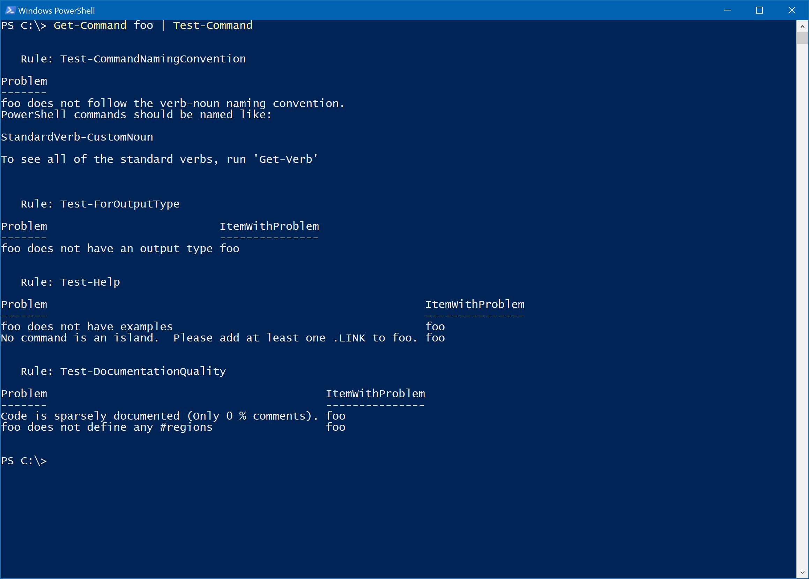

ScriptCop [1.6]
===============

A PowerShell Static Analysis Tool to help your scripts follow the rules.
---------------

### Commands
-----------------------------
|      Verb|Noun            |
|---------:|:---------------|
|   Disable|-CommandCoverage|
|    Enable|-CommandCoverage|
|       Get|-CommandCoverage|
|          |-ScriptCopFixer |
|          |-ScriptCopPatrol|
|          |-ScriptCopRule  |
|  Register|-ScriptCopFixer |
|          |-ScriptCopPatrol|
|          |-ScriptCopRule  |
|    Repair|-Command        |
|      Show|-ScriptCoverage |
|      Test|-Command        |
|          |-Module         |
|Unregister|-ScriptCopFixer |
|          |-ScriptCopPatrol|
|          |-ScriptCopRule  |
-----------------------------
ScriptCop is a static analysis and testing tool for PowerShell.  It helps make sure your scripts follow the rules.

### Using ScriptCop for Static Analysis

You can run pipe in a command or a module to perform static analysis 
~~~Powershell
function foo() {

}

Get-Command foo | Test-Command
~~~

When using ScriptCop analyzes your scripts, it it doesn't run your code, but it examines your code for a set of well-known problems.
You can write custom rules to flag bad scripting style, or you can use the dozens of rules built into ScriptCop.

### Testing with ScriptCop

You can also use ScriptCop to test your modules.  
By default, every module command's examples and any demos become test cases for your module.  
You can also write your own tests (.test.ps1) files to make sure different parts are working.

You can declare a .ScriptCop.psd1 manifest to group your tests and control what runs by default.

For instance, here is the ScriptCop.ScriptCop.psd1:

~~~Powershell
@{
    Demo = "A Quick Intro to ScriptCop"
    Coverage = 'ScriptCoverage'
    ExampleTests = 'Show-ScriptCoverage:1'
    RuleGetters = 'Get-ScriptCopRule:1', 'Get-ScriptCopPatrol:1', 'Get-ScriptCopFixer:1'
    ScriptCop = '*'
}
~~~

Each key is the name of a test group.  

The group "ScriptCop" is a special group, and it describes the name of static analysis rules you would like to run on each command.

